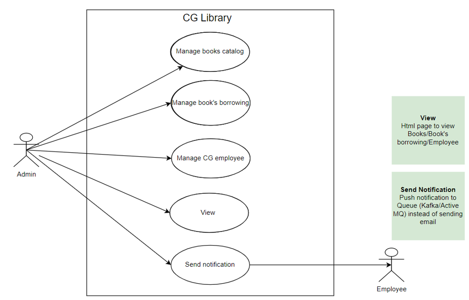
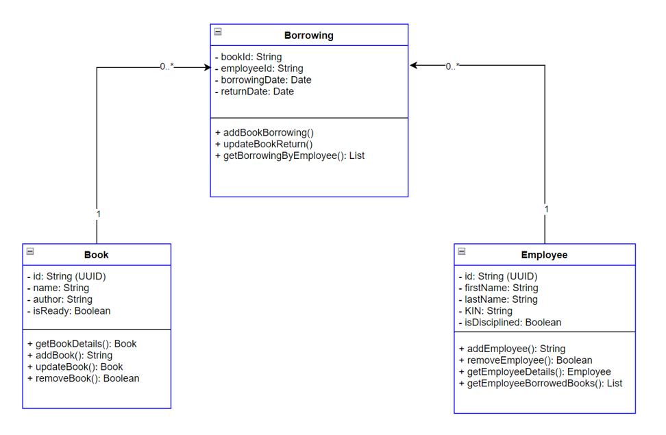
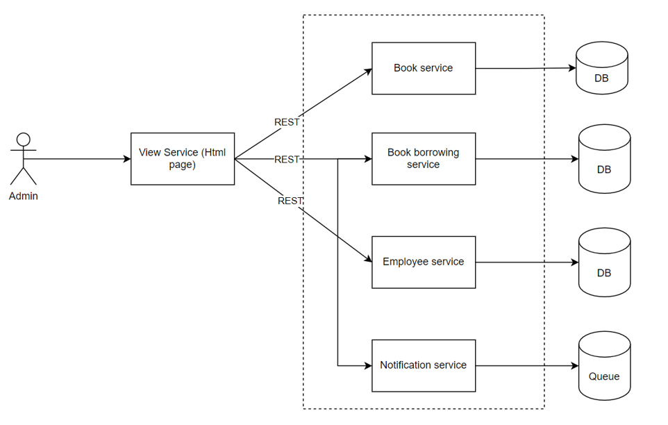
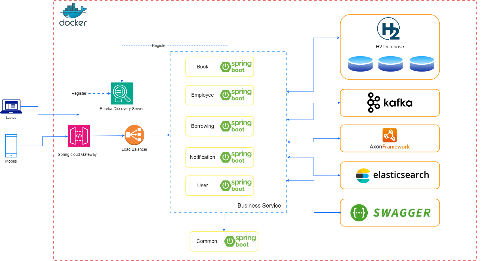

# Microservice with Spring Boot and eventSourcing

## 1. **What will you have learned from excercise**

- New stuff of Java 8 and many more
- Use Spring Boot to build microservices
- Bring standalone services to microservices architecture
- Understanding about event driven architecture
- How to manage a transaction in a distributed environment
- Moving services to containers world (Docker) - Advanced level (Optional)
- Orchestrate them using K8s - Advanced level (Optional)
- Kong API Gateway
- Unit test, integration tests
- Scan code, security

## 2. **About CGLibrary**:

It's a library management system. It covers every aspect and every task that librarians, as well as users, might use. Use this application you can do the following things

- Manage books catalog
- Manage books borrowing
- Manage CG employees, who will borrow books
- Send notifications to employees when a book was returned, a book's borrowing was added

## 3. Use Case: Quản lý thư viện

## 4. Class Diagram

## 5. API Description

### i. Book Service API

| Functionality    | Method | Path                   |
| ---------------- | ------ | ---------------------- |
| Get book details | GET    | /api/v1/books/{bookId} |
| Add book         | POST   | /api/v1/books          |
| Update book      | PUT    | /api/v1/books/{bookId} |
| Delete book      | DELETE | /api/v1/books/{bookId} |

### ii. Book Borrowing Service API

| Functionality                  | Method | Path                                    |
| ------------------------------ | ------ | --------------------------------------- |
| Get book borrowing by employee | GET    | /api /v1/borrowing/{employeeId}         |
| Add a new borrowing            | POST   | /api/v1/borrowing                       |
| Update a book return           | PUT    | /api/v1/borrowing/{employeeId}/{bookId} |

### iii. Employee Service API

| Functionality                   | Method | Path                                  |
| ------------------------------- | ------ | ------------------------------------- |
| Get employee details            | GET    | /api /v1/employees/{employeeId}       |
| Get borrowed books for employee | GET    | /api /v1/employees/{employeeId}/books |
| Add new employee                | POST   | /api/v1/employees                     |
| Remove employee Delete book     | DELETE | /api/v1/employees/{employeeId}        |

### iv. Notification service

Used to send notifications to employees once

- Book was returned
- New book's borrowing was added

## 6. Architecture

## 7. Where to apply the design principles?

- i. CQRS will be applied for Book service (first step), then other services later.
- ii. SAGA should be applied for booking service. Based on the rules of borrowing a book to determine when a transaction is rolled back. (for instance: employee gets disciplined)
  - 1. Create a record in the borrowing table
  - 2. Update status of book to false
  - 3. Employee who is not disciplined is valid for borrowing a book

## 8. References

### i. How to implement CQRS

- https://progressivecoder.com/event-sourcing-and-cqrs-with-axon-and-spring-boot-part-1/

- https://progressivecoder.com/implementing-event-sourcing-using-axon-and-spring-boot-part-1/
- https://progressivecoder.com/implementing-event-sourcing-with-axon-and-spring-boot-part-2//
- https://progressivecoder.com/implementing-event-sourcing-with-axon-and-spring-boot-part-3//

### ii. How to implement SAGA (orchestration-based Saga)

- https://progressivecoder.com/wp-content/cache/all/saga-pattern-implementation-with-axon-and-spring-boot-part-1/index.html

- https://progressivecoder.com/saga-pattern-implementation-axon-spring-boot-part-2/
- https://progressivecoder.com/saga-pattern-implementation-axon-spring-boot-part-3/
- https://progressivecoder.com/saga-pattern-implementation-with-axon-and-spring-boot-part-4/

## 9. Minimum Microservice architecture for reference

