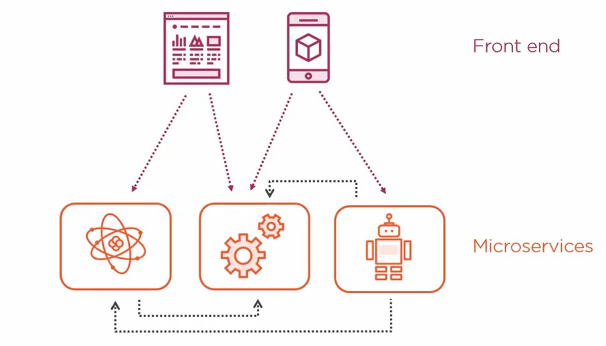

# Microservices Architecture

## 1. Introduction

### **Monolithic architecture**

- Trong kiến trúc này, toàn bộ ứng dụng được xây dựng như một khối duy nhất, bao gồm tất cả các chức năng như giao diện người dùng (UI), logic nghiệp vụ và truy cập dữ liệu trong một codebase.

#### **Ưu điểm:**

- **Đơn giản**: Dễ phát triển, triển khai và kiểm thử khi ứng dụng còn nhỏ.
- **Hiệu năng**: Giao tiếp giữa các thành phần nhanh chóng vì chúng nằm trong cùng một tiến trình.

#### **Nhược điểm:**

- **Khó bảo trì**: Khi ứng dụng phức tạp dần, việc sửa đổi và bảo trì trở nên khó khăn.
- **Khả năng mở rộng hạn chế**: Khó mở rộng từng phần của ứng dụng khi cần thiết.
- **Độ tin cậy thấp**: Lỗi ở một thành phần có thể ảnh hưởng đến toàn bộ hệ thống.

### **Microservice Architecture**

- Kiến trúc này chia nhỏ ứng dụng thành các dịch vụ độc lập, mỗi dịch vụ chịu trách nhiệm cho một chức năng cụ thể. Các dịch vụ này giao tiếp với nhau thông qua API.

#### **Ưu điểm:**

- **Dễ bảo trì và phát triển**: Mỗi dịch vụ có thể được phát triển, triển khai và mở rộng độc lập.
- **Độ tin cậy cao**: Lỗi ở một dịch vụ không ảnh hưởng đến các dịch vụ khác.
- **Khả năng mở rộng tốt**: Dễ dàng mở rộng từng dịch vụ riêng lẻ để đáp ứng nhu cầu.

#### **Nhược điểm:**

- **Phức tạp**: Việc quản lý và điều phối nhiều dịch vụ có thể phức tạp.
- **Hiệu năng**: Giao tiếp giữa các dịch vụ có thể chậm hơn do phải thông qua mạng.

#### **So sánh:**

| Đặc điểm         | Kiến trúc nguyên khối                  | Kiến trúc vi dịch vụ                  |
| ---------------- | -------------------------------------- | ------------------------------------- |
| Kích thước       | Một khối duy nhất                      | Nhiều dịch vụ nhỏ                     |
| Phát triển       | Đơn giản ban đầu, phức tạp khi mở rộng | Phức tạp hơn ban đầu, dễ dàng mở rộng |
| Triển khai       | Dễ dàng                                | Phức tạp hơn                          |
| Bảo trì          | Khó khăn khi ứng dụng lớn              | Dễ dàng hơn                           |
| Khả năng mở rộng | Hạn chế                                | Linh hoạt                             |
| Độ tin cậy       | Thấp                                   | Cao                                   |
| Hiệu năng        | Cao                                    | Có thể thấp hơn                       |

### 2. Problem monolithic

#### **Nhược điểm:**

- Scale từng module khiến code phình to
- Thêm và sửa code rất phức tạp
- Deploy khó khăn

### 3. Solution

#### **Ưu điểm:**

- Dễ dàng scale tiết kiệm chi phí
- Dễ dàng deploy
- Tự do sử dụng các công nghệ ở mỗi service
- Khó sập hơn monolithic

#### **Nhược điểm**

- Khó đọc code, debug
- Quản lý khó khan
- Cần đội ngũ team chuyên nghiệp

### 4. Architecting Microservices

- Mỗi microservice đều phải có cơ sở dữ liệu riêng
- Tính độc lập

- Xác định ranh giới Service
- Giảm thiểu việc gọi request ở nhiều nơi
- Quản lý code dễ dàng

- Ở đây, UserService chứa profile, address và user (3 thành phần này liên quan mật thiết đến nhau nên việc tách 3 thành phần kia thành service sẽ có hại nhiều hơn có lợi vì 3 thành phần trên sẽ gọi liên tục đến nhau nên là nếu tách riêng sẽ làm cho việc gọi request ở nhiều nơi sẽ làm chậm ứng dụng).

### 5. eShopOnContainers Architecture

### 6. Communication

#### **Khong khuyen khich**

#### **Khuyen khich**

### 7. Synchronious communication

#### Sample microservices

#### Use circuit breaker

### 8. Asynchronous communication

- Hình ảnh này minh họa cách các dịch vụ giao tiếp với nhau trong một kiến trúc vi dịch vụ (Microservices) sử dụng Event bus.

#### **Cụ thể hơn, ta có:**

- **Microservices:** Hình ảnh hiển thị 4 microservices, mỗi dịch vụ có một chức năng riêng biệt (ví dụ: Order Service xử lý đơn hàng, Notification Service gửi thông báo).
- **Event bus:** Đây là một hệ thống trung gian cho phép các microservices giao tiếp với nhau một cách không đồng bộ. Các dịch vụ gửi sự kiện (events) lên event bus, và các dịch vụ khác có thể lắng nghe và phản ứng với các sự kiện này.
- **RabbitMQ, Kafka:** Đây là các ví dụ về công nghệ thường được sử dụng để triển khai event bus.

#### **Cách thức hoạt động:**

- **Order Service** xử lý một đơn hàng và tạo ra một sự kiện (ví dụ: "Đơn hàng đã được tạo").
- **Order Service** gửi sự kiện này lên **Event bus**.
- **Notification Service** (và có thể các dịch vụ khác) đang lắng nghe trên event bus và nhận được sự kiện "Đơn hàng đã được tạo".
- **Notification Service** xử lý sự kiện này bằng cách gửi email thông báo cho khách hàng.

#### **Lợi ích của việc sử dụng Event bus:**

- **Giảm sự phụ thuộc:** Các dịch vụ không cần biết về nhau, chỉ cần tương tác với event bus.
- **Tăng khả năng mở rộng:** Dễ dàng thêm hoặc bớt dịch vụ mà không ảnh hưởng đến các dịch vụ khác.
- **Cải thiện hiệu năng:** Giao tiếp không đồng bộ giúp các dịch vụ hoạt động độc lập và không bị chặn bởi nhau.

### 9. Service Registry

- Hình ảnh mô tả **Service Registry Pattern**, một mẫu thiết kế phổ biến trong kiến trúc vi dịch vụ (microservices). Mẫu này giúp quản lý và khám phá các dịch vụ trong một hệ thống phân tán.

#### **Các thành phần:**

- **Client:** Người dùng hoặc ứng dụng muốn sử dụng một dịch vụ.
- **Gateway:** Cổng vào hệ thống, tiếp nhận yêu cầu từ client và chuyển tiếp đến dịch vụ tương ứng.
- **Service Registry:** Một cơ sở dữ liệu chứa thông tin về các dịch vụ đang hoạt động, bao gồm tên dịch vụ, địa chỉ IP, cổng, và các metadata khác.
- **Product, ShoppingCart, Pricing, Order:** Các dịch vụ trong hệ thống, mỗi dịch vụ có chức năng riêng biệt.

#### **Cách thức hoạt động:**

- **Đăng ký dịch vụ (Register):** Khi một dịch vụ khởi động, nó sẽ đăng ký thông tin của mình với Service Registry.
- **Khám phá dịch vụ (Get IPs):** Khi client muốn sử dụng một dịch vụ, Gateway sẽ hỏi Service Registry về địa chỉ IP của dịch vụ đó.
- **Chuyển tiếp yêu cầu (Call IPs):** Sau khi nhận được địa chỉ IP từ Service Registry, Gateway sẽ chuyển tiếp yêu cầu của client đến dịch vụ tương ứng.

### **Lợi ích của Service Registry Pattern:**

- **Giảm sự phụ thuộc:** Các dịch vụ không cần biết địa chỉ IP của nhau, chỉ cần tương tác với **Service Registry.**
- **Tăng tính linh hoạt: D**ễ dàng thêm, bớt hoặc di chuyển dịch vụ mà không cần cấu hình lại client.
- **Cải thiện khả năng chịu lỗi:** Nếu một dịch vụ gặp sự cố, **Service Registry** có thể chuyển hướng yêu cầu đến một phiên bản khác của dịch vụ đó.

#### **Ví dụ:**

**Giả sử client muốn thêm một sản phẩm vào giỏ hàng.**

1. Client gửi yêu cầu đến Gateway.
2. Gateway hỏi Service Registry về địa chỉ IP của dịch vụ ShoppingCart.
3. Service Registry trả về địa chỉ IP của ShoppingCart.
4. Gateway chuyển tiếp yêu cầu đến ShoppingCart.
5. ShoppingCart xử lý yêu cầu và trả về kết quả cho client thông qua Gateway.

### 10. Security Microservices

- Mã hóa dữ liệu bằng Giao thức **TLS protocol (Transport Layer Security)**
- **Authentication**
- **Authorization**

### High level security

